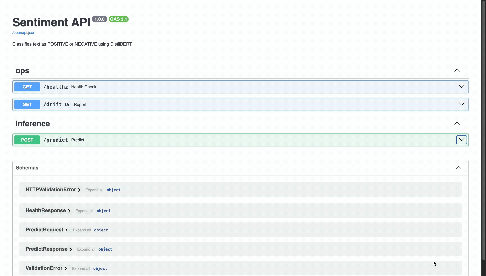

# Case 9: Model Serving Lite

[](https://deepwiki.com/MoSahil147/case9-model-serving-lite)

**Live demo:** https://sahil147-sentiment-api.hf.space

**Repo:** https://github.com/MoSahil147/case9-model-serving-lite

## See it in action

**Demo video:** https://youtu.be/I72wTh14LEI?si=YVxEWzcr2F0cD-RF



[](https://github.com/MoSahil147/case9-model-serving-lite/actions/workflows/ci.yml)

---

## What this is

A sentiment classification API that takes a data scientist's notebook model and turns it into a monitored production service. It is built for any team that wants to ship an NLP model and actually know when it starts going wrong before a customer does.

---

## How to run locally

**With Docker:**

```bash
git clone https://github.com/MoSahil147/case9-model-serving-lite.git
cd case9-model-serving-lite
docker build -t sentiment-api .
docker run -p 7860:7860 sentiment-api
```

Then open http://localhost:7860/docs

**Without Docker (using uv):**

```bash
git clone https://github.com/MoSahil147/case9-model-serving-lite.git
cd case9-model-serving-lite
uv sync
uv run uvicorn app.main:app --host 0.0.0.0 --port 7860 --reload
```

`uv sync` reads `uv.lock` and installs the exact pinned environment — no `pip install` or `requirements.txt` needed.

Note: the first run downloads about 270 MB of model weights. After that it loads from cache.

---

## Quick Start

```bash
curl -X POST https://sahil147-sentiment-api.hf.space/predict \
  -H "Content-Type: application/json" \
  -d '{"text": "This product is absolutely brilliant and exceeded every expectation."}'
```

Response:

```json
{
  "label": "POSITIVE",
  "score": 0.999812,
  "model_version": "sha-a1b2c3d",
  "latency_ms": 148.3
}
```

| Endpoint | Method | Purpose |
|---|---|---|
| `/healthz` | GET | Liveness check — returns `{"status": "ok"}` |
| `/predict` | POST | Classify text as POSITIVE or NEGATIVE (1–2048 chars) |
| `/drift` | GET | Current drift monitoring report with status, signals and alerts |
| `/docs` | GET | Auto-generated OpenAPI documentation — live at https://sahil147-sentiment-api.hf.space/docs |

---

## Stack

| Component | Choice | Why |
|---|---|---|
| API framework | FastAPI 0.128.0 | Async support and automatic OpenAPI docs out of the box |
| Data validation | Pydantic v2.7.1 | `Annotated` field constraints and `field_validator` for input sanitization |
| Model | DistilBERT (SST-2) | 40% smaller and 60% faster than BERT-base with less than 3% accuracy loss on CPU |
| Inference | Transformers 4.57.3 with `device_map="auto"` | Auto-selects CPU/GPU/MPS — no hardcoded device |
| Package manager | uv | Replaces pip + requirements files; 10-100x faster installs, lockfile-driven |
| Container | Docker multi-stage (`python:3.11.12-slim`) | Bakes model weights in at build time; pinned base image for reproducible builds |
| Registry | ghcr.io | Free for public repos and uses GITHUB_TOKEN with no extra setup needed |
| Hosting | HuggingFace Spaces (Docker SDK) | Free tier with automatic HTTPS and the natural home for ML model demos |
| CI | GitHub Actions (`actions/checkout@v6`, `astral-sh/setup-uv@v8.1.0`) | Lint, test, build and push in one pipeline |
| Logging | JSON Lines to stdout with millisecond timestamps | Universal sink that HF Spaces captures automatically |
| Linting | ruff (via `uv run ruff`) | Replaces flake8 and black in one tool |

---

## How Would I Know This Model Is Failing Before Customers Do?

This was the most interesting part of the project for me. I built four layers of detection.

**Layer 1: Input drift (leading indicator)**

The `/drift` endpoint compares the statistical properties of recent requests against the training data: character length, non-ASCII fraction and vocabulary novelty (OOV rate). OOV tokens are extracted with `re.findall(r'\b\w+\b')` so punctuation does not artificially inflate the out-of-vocabulary rate. A shift in any of these signals means the model is seeing inputs that look very different from what it was trained on. You can set up UptimeRobot to ping `/drift` every five minutes and alert when `"status": "alert"` comes back.

**Layer 2: Confidence distribution (concurrent indicator)**

Every prediction writes a JSON log line with a `score` field. A healthy sentiment model is rarely uncertain and most scores should be above 0.85. A spike in low-confidence predictions around 0.50 to 0.70 means the model is struggling.

```bash
cat logs/api.log | jq 'select(.status == 200) | .response_snippet | fromjson | select(.score < 0.75)'
```

**Layer 3: Error rate and latency (trailing indicator)**

The structured logs also capture HTTP status codes and `duration_ms` per request (millisecond precision). A spike in 500 errors or P99 latency usually means a dependency broke after a package update.

```bash
cat logs/api.log | jq 'select(.status >= 500) | {ts, path, duration_ms}'
```

**Layer 4: CI gate (proactive)**

No regressed model can be promoted. The retrain workflow compares every candidate model against the frozen evaluation set before merging the PR. If the new model scores worse than the baseline it gets blocked automatically with a comment explaining why.

---

## CI/CD Pipeline

```
Push to main
    |
    |-- lint-and-test
    |       |-- uv sync (installs from uv.lock exactly)
    |       |-- uv run ruff check and format
    |       `-- uv run pytest (model mocked so no download needed)
    |
    |-- build-and-push  (main only)
    |       |-- docker build with GIT_SHA baked in
    |       `-- push to ghcr.io with tags sha-<sha> and latest
    |
    `-- deploy  (main only)
            `-- upload to HuggingFace Spaces via HF Hub API

PR touching data/train.csv
    |
    `-- retrain-and-gate
            |-- guard: reject if eval.csv was also modified
            |-- uv run python scripts/retrain.py   (fine-tune for 2 epochs)
            |-- uv run python scripts/evaluate.py  (run on held-out eval.csv, device_map=auto)
            `-- uv run python scripts/check_metrics.py
                    |-- PASS: commit new baseline.json and auto-merge PR
                    `-- FAIL: comment on PR with details and exit 1
```

**Docker image tagging:**
- `sha-<commit>` — tied to the exact commit, used for tracing bad predictions back to code
- `latest` — always points to the newest build, used by HuggingFace Spaces for deploys

---

## What's NOT done

- **Authentication.** A real service would need an API key in the request header. I left it out so judges can call the endpoint with a bare curl command without any setup.
- **Persistent drift storage.** The drift window lives in memory and resets on container restart. Production would push signals to Prometheus and query them in Grafana.
- **GPU support.** The free-tier host has no GPU. DistilBERT runs at 130-200 ms on CPU which is fine for a demo. The code uses `device_map="auto"` so it will use a GPU automatically if one becomes available.
- **Shadow deployment.** Routing a small percentage of traffic to a candidate model alongside production is a great idea but it would take more than one day to wire up properly.

---

## In production, I would also add

- A `/metrics` endpoint in Prometheus format so Grafana can show request rate, latency percentiles and drift signals on one dashboard.
- Redis-backed drift storage so signals survive container restarts and aggregate across workers.
- Rate limiting via SlowAPI to stop a single caller from flooding the service.
- A warm-up ping from the CI deploy step so HF Spaces does not serve a cold-start request to the first real caller.
- Proper API key authentication with key rotation and a revocation endpoint.
